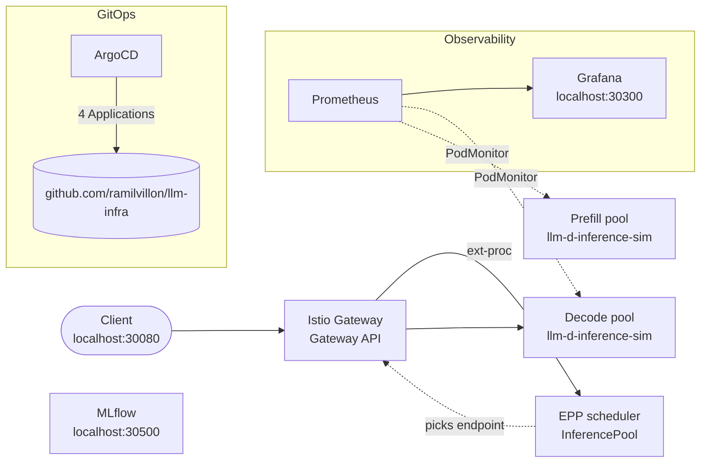

# llm-infra

A reproducible, one-command [llm-d](https://github.com/llm-d) inference stack
on a local `kind` cluster. It runs disaggregated prefill/decode serving,
inference-aware routing, observability, experiment tracking, and GitOps, all
on a laptop and without GPUs.

## What it is

`make up` brings up a full llm-d serving topology on Kubernetes:

- **Istio Gateway** (Gateway API + Gateway API Inference Extension) as the
  OpenAI-compatible entry point
- **EPP scheduler** (InferencePool endpoint picker), which routes requests
  to model servers by KV-cache and load instead of plain round-robin
- **Separate prefill and decode pools** running
  [`llm-d-inference-sim`](https://github.com/llm-d/llm-d-inference-sim), a
  vLLM-compatible simulator, so no GPUs are needed
- **Prometheus** (kube-prometheus-stack) scraping both pools through a
  PodMonitor
- **Grafana** dashboard showing TTFT p95, TPOT p95, queue depth, and KV-cache
  utilisation per pool
- **MLflow** tracking server
- **ArgoCD** with four Applications (`llm-d-infra`, `llm-d`,
  `observability`, `mlflow`) that sync from this repo

Every chart, CRD, and image version is pinned in
[`local/versions.env`](local/versions.env), and so is the kind node image,
which keeps a cold rebuild reproducible.

## Architecture



ArgoCD owns the llm-d gateway and pools, the observability stack, and MLflow.
The InferencePool/EPP chart and a few objects that no chart declares (the
InferenceObjective CRD, the pools PodMonitor, and the dashboard ConfigMap)
are applied by `make up`. A dedicated test (`11-makefile-gates`) checks that
nothing needed for a cold rebuild exists only on the live cluster.

**Scope:** this stack proves the *topology*: two independently scaled,
separately scraped pools, with EPP scheduling in the request path. It does
not prove the prefill/decode traffic split. The prefill pool does not serve
traffic here (`routing.proxy.enabled: false`), so the TTFT and TPOT panels
show only a decode series. Real prefill/decode handoff needs real vLLM on
GPUs.

## Quickstart

Prerequisites: `colima`, `docker`, `kind`, `kubectl`, `helm` >= 3.10,
`istioctl`, `jq`, `yq`, `gh`. colima needs at least 6 CPUs, 12 GB RAM, and
60 GB disk (`make up` starts it with those settings if it isn't running).

```bash
cd local
make up      # colima + kind cluster + CRDs + Istio + ArgoCD + EPP; waits for all 4 Apps to sync
make test    # runs the numbered test suite against the live cluster; prints ALL PASS
make load    # 50 concurrent chat completions, to populate the dashboard
make down    # delete the cluster
```

Send a request through the gateway:

```bash
curl -s localhost:30080/v1/chat/completions \
  -H 'Content-Type: application/json' \
  -d '{"model":"llm-d-chat","messages":[{"role":"user","content":"hello"}]}' | jq .
```

### Endpoints

These are NodePorts bound to `127.0.0.1` only.

| Port | Service |
|---|---|
| `localhost:30080` | Gateway (OpenAI-compatible `/v1/chat/completions`) |
| `localhost:30300` | Grafana (`admin` / `admin`) |
| `localhost:30500` | MLflow tracking server |

### Test suite

`make test` runs `local/test/*.sh` in order and stops at the first failure.
Each script checks one layer of the stack:

| Script | Checks |
|---|---|
| `00-toolchain` | Required CLIs are on `PATH` |
| `01-cluster` | 3-node kind cluster, prefill/decode node labels, pinned node image |
| `02-versions` | Every `versions.env` pin is set to a concrete version |
| `03-gateway` | Gateway API, InferencePool, and InferenceObjective CRDs; istiod ready |
| `04-sim` | Simulator answers chat completions and exposes `vllm:` metrics |
| `05-routing` | Gateway → InferencePool → EPP routing end to end |
| `06-disaggregation` | Separate prefill and decode pods are running |
| `07-prometheus` | Prometheus is scraping both pools |
| `08-grafana` | Dashboard has 4 panels, grouped by pool, using only real metric names |
| `09-mlflow` | MLflow tracking server is up |
| `10-argocd` | All four ArgoCD Applications are Synced |
| `11-makefile-gates` | Every imperatively applied object is replayed by `make up` |

## Tech stack

Kubernetes (kind) · llm-d (modelservice, infra charts) · Gateway API +
Inference Extension (InferencePool, EPP) · Istio · Helm · ArgoCD ·
Prometheus (kube-prometheus-stack) · Grafana · MLflow · Bash · Make

## Repo layout

```
argocd/applications/   Four ArgoCD Application specs (llm-d-infra, llm-d, observability, mlflow)
charts/                Helm values for each Application, plus the Grafana dashboard JSON
  llm-d/               Gateway, InferencePool/EPP, and prefill/decode modelservice values
  observability/       kube-prometheus-stack values + dashboards/llm-d-serving.json
  mlflow/              MLflow values
local/                 Makefile, kind config, pinned versions, extra manifests, test suite
```

Note that ArgoCD syncs from GitHub, not from your working tree. Changes to
`charts/` or `argocd/` take effect only after they're pushed.

For prerequisites, every make target, and troubleshooting details, see
[`local/README.md`](local/README.md). For Apple Silicon image notes, see
[`local/ARM64-NOTES.md`](local/ARM64-NOTES.md).
